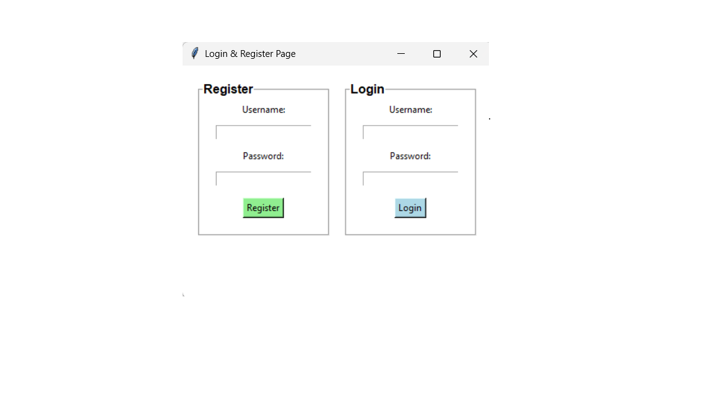
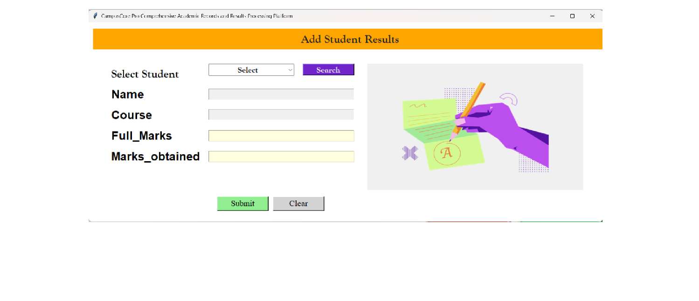
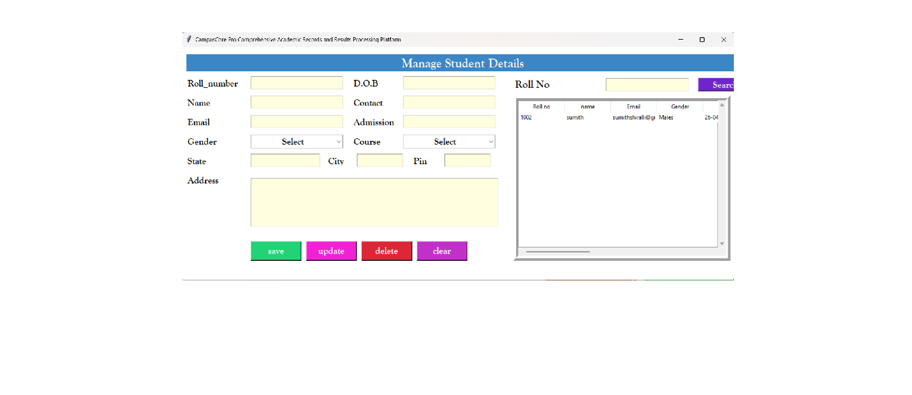
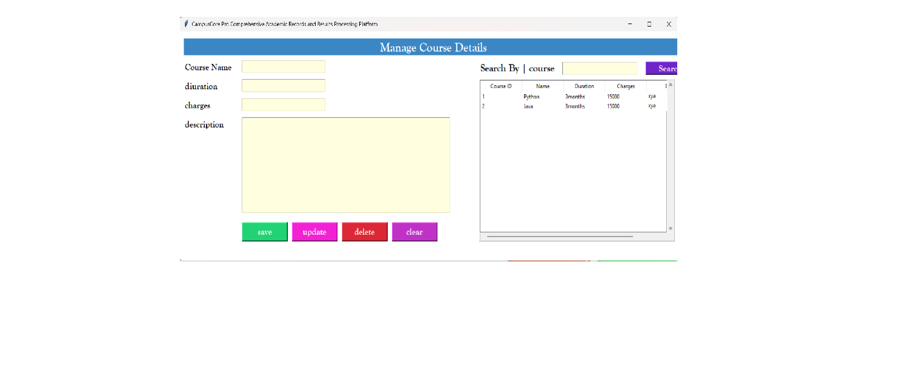
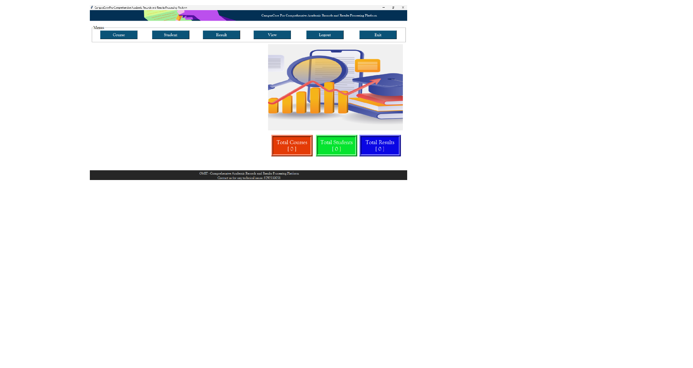

# 🎓 Student Exam Portal

A **Comprehensive Academic Records and Results Processing Platform** built with Python and SQLite.

---

## 📌 Features

- 🔐 **Login & Register System**  
- 👨‍🎓 **Manage Student Details** (Add, Update, Delete, Search)  
- 📚 **Manage Course Details** (Add, Update, Delete, Search)  
- 📝 **Add & Manage Student Results**  
- 📊 **Dashboard View** (Total Students, Courses, Results)  
- 🚪 **Logout & Exit options**  

---

## 🖼️ Snapshots

### 🔐 Login & Register Page


### 📝 Add Student Results


### 👨‍🎓 Manage Student Details


### 📚 Manage Course Details


### 📊 Dashboard


---

## ⚙️ Tech Stack

- **Python** (Tkinter GUI)  
- **SQLite** (Database: `RMS.db`)  
- **Pillow** (for image handling)  

---

## 🚀 Run Locally

1. Clone the repository:
   ```bash
   git clone https://github.com/Sumith-M-S/Student_Exam_Portal.git
   cd Student_Exam_Portal
